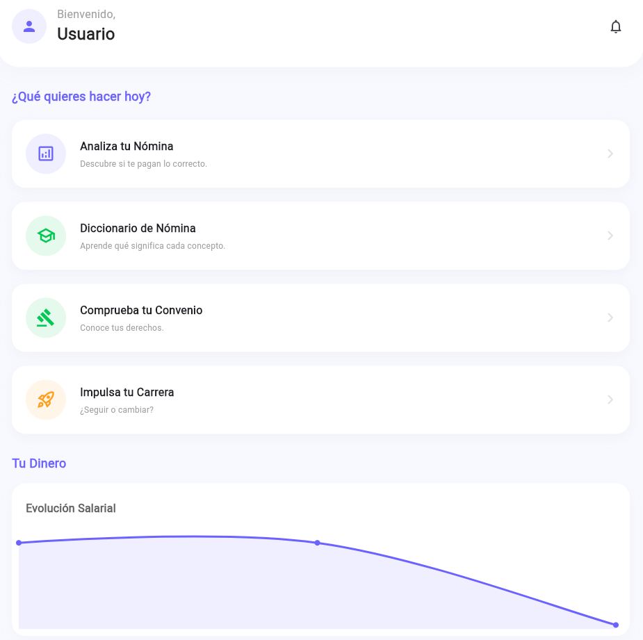
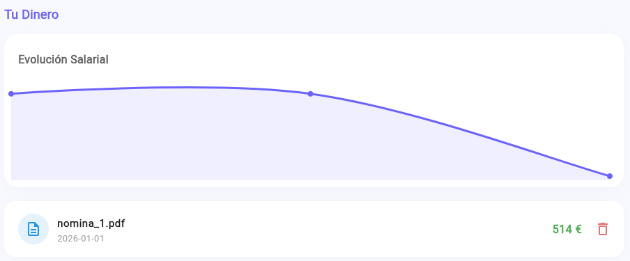
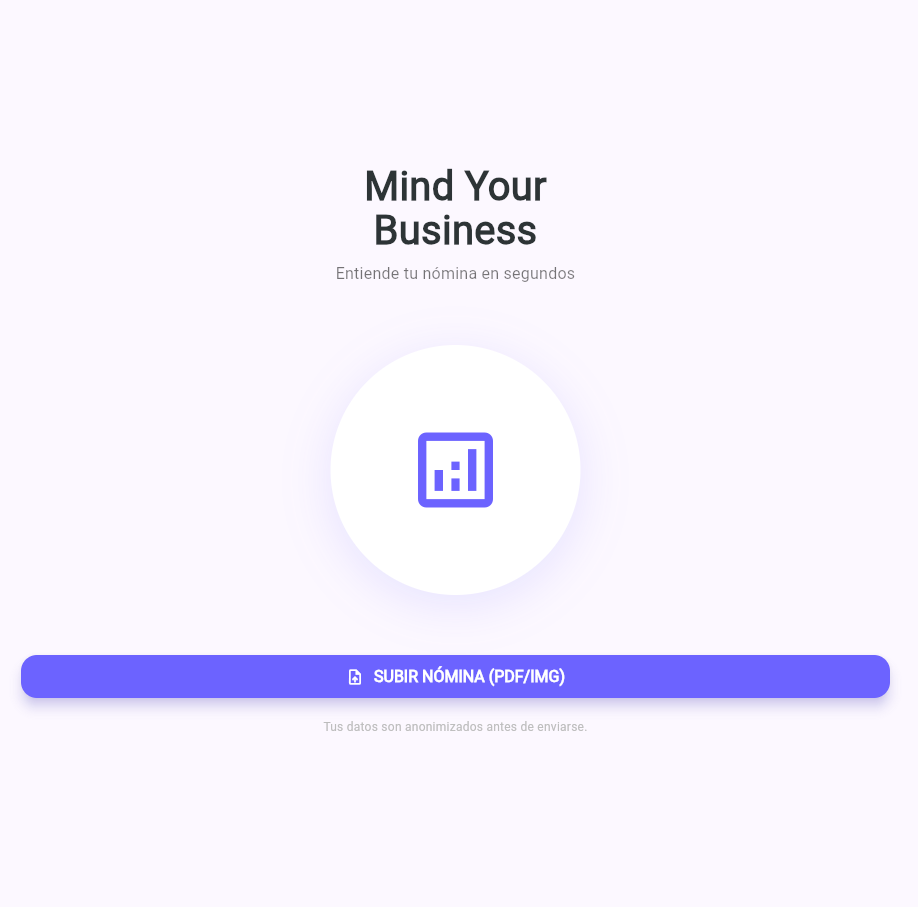
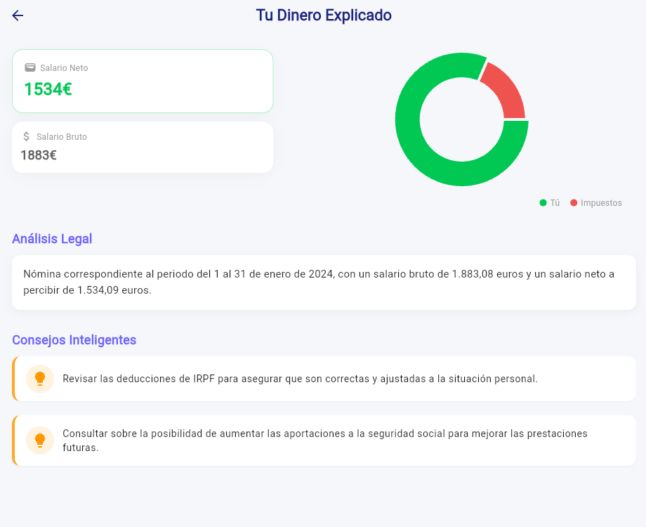
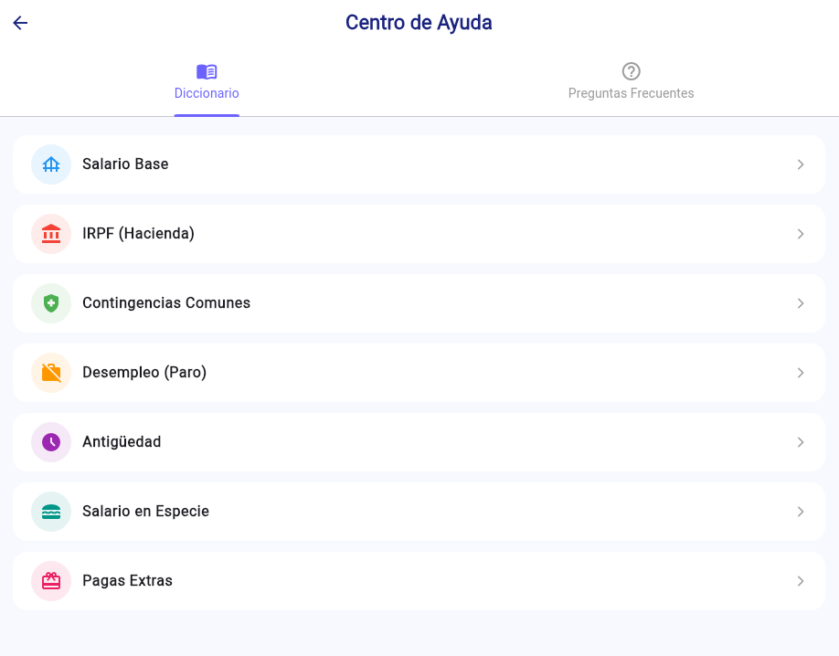
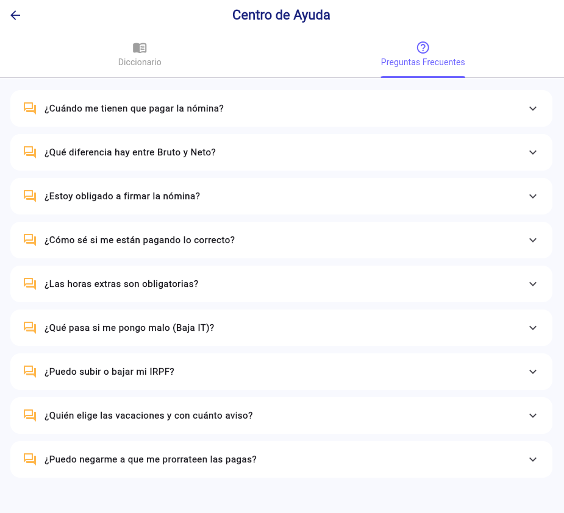
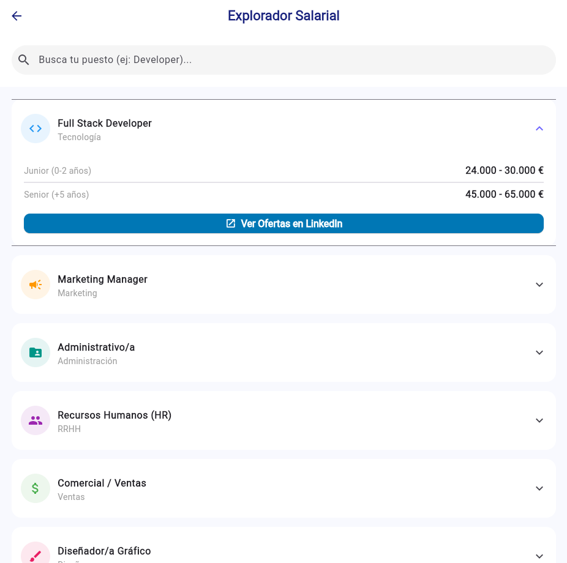

# Mind Your Business (MYB) 🧠💼

> **Plataforma LegalTech para el Análisis Inteligente de Nóminas y Salud Financiera.**

---

## 🚀 Sobre el Proyecto

**Mind Your Business (MYB)** es una solución Full Stack diseñada para democratizar la comprensión de documentos laborales. Utilizando Inteligencia Artificial Generativa (LLMs) y técnicas de Visión Computacional, la aplicación transforma nóminas complejas (PDFs o Imágenes) en *insights* financieros claros, permitiendo a los usuarios entender sus retenciones, devengos y evolución salarial.

> **Nota:** Este repositorio es un **Portfolio Showcase**. Dado que MYB es un producto comercial en desarrollo, el código fuente completo se mantiene en repositorios privados para proteger la Propiedad Intelectual. Aquí se presentan la arquitectura, decisiones técnicas y fragmentos de código seleccionados.

---

## 📸 Galería & UI

| Dashboard Principal | Subida de Documentos | Análisis Detallado | Aprendizaje conceptos | Buscador Empleo |
|:---:|:---:|:---:|
|  |  |  |  |  |  |  |

---

## 🏗️ Arquitectura del Sistema

El proyecto sigue una arquitectura de microservicios modularizada, desplegada mediante contenedores Docker.

### Backend (Python & FastAPI)
* **API Gateway:** Gestionado con FastAPI para alto rendimiento asíncrono.
* **AI Engine:** Orquestación de modelos GPT-4o para extracción de datos no estructurados y análisis jurídico.
* **OCR Híbrido:** Pipeline inteligente que selecciona entre extracción de texto nativa (PyMuPDF) o Visión Computacional (EasyOCR/GPT-Vision) según la calidad del documento.
* **Privacy Layer:** Capa intermedia de anonimización (Regex + NLP con SpaCy) que elimina datos sensibles (PII) antes de enviar información a proveedores externos.
* **Persistencia:** Base de datos NoSQL (MongoDB) gestionada con **Beanie ODM** para flexibilidad de esquemas.

### Frontend (Flutter & Dart)
* **Clean Architecture:** Separación estricta entre Capa de Presentación (UI), Dominio (Lógica) y Datos (Repositorios/API).
* **State Management:** Gestión reactiva del estado para actualizaciones en tiempo real (Cargas, Errores, Éxito).
* **Visualización de Datos:** Implementación de gráficas interactivas (`fl_chart`) para renderizar la evolución salarial.
* **Cross-Platform:** Código base único compilado para Android, iOS y Web.

---

## 💻 Code Samples (Snippets)

Aunque el núcleo del negocio es privado, aquí se exponen ejemplos de la calidad y estructura del código:

### 1. Frontend: Modularización de UI (Widgets)
*El uso de widgets atómicos permite una interfaz escalable y mantenible.*
[Ver código de ejemplo (SalaryChart)](code_samples/frontend/salary_chart.dart)

### 2. Backend: Modelo de Datos (ODM)
*Estructura de datos persistente utilizando Pydantic y Beanie para MongoDB.*
[Ver código de ejemplo (Models)](code_samples/backend/models.py)

### 3. Configuración: Gestión de Temas
*Centralización de estilos para mantener la coherencia visual.*
[Ver código de ejemplo (AppTheme)](code_samples/frontend/theme.dart)

---

## 🛠️ Stack Tecnológico Completo

* **Lenguajes:** Dart, Python 3.11.
* **Frameworks:** Flutter 3.x, FastAPI.
* **IA & Data:** OpenAI API, NumPy, Pandas, SpaCy.
* **Infraestructura:** Docker, Docker Compose.
* **Herramientas:** Git, VS Code, Postman.

---

### 📫 Contacto

Desarrollado por **Luz Vicent**.
* [LinkedIn](https://www.linkedin.com/in/luz-vicent-gigante)
* [Email](mailto:luzvicentgigante@gmail.com)
